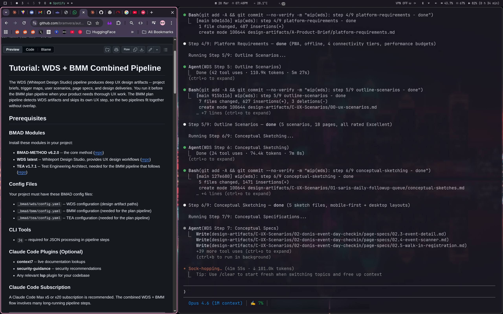
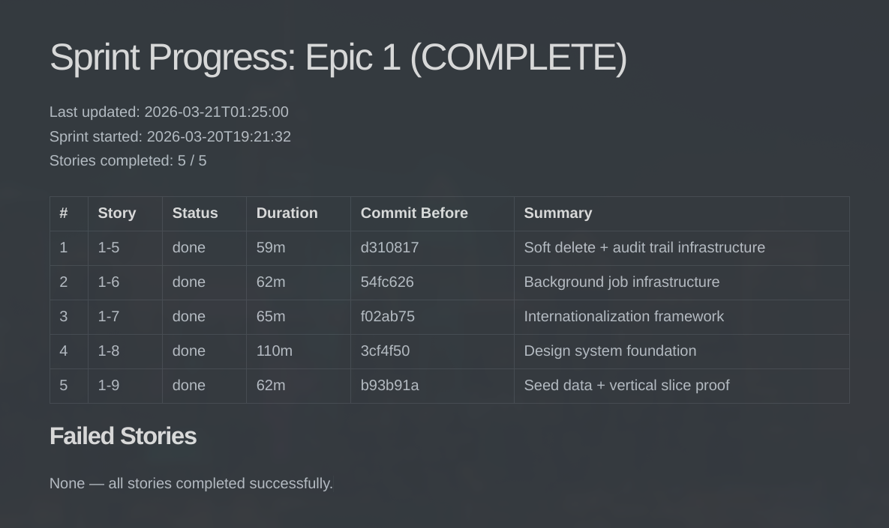

# Auto BMAD

[](LICENSE.md) [](https://docs.anthropic.com/en/docs/claude-code) [](https://github.com/bmad-code-org/BMAD-METHOD/releases/tag/v6.2.0) [](https://github.com/bmad-code-org/bmad-method-test-architecture-enterprise/releases/tag/v1.7.1) [](https://github.com/bmad-code-org/bmad-module-game-dev-studio/releases/tag/v0.2.2) [](https://github.com/bmad-code-org/bmad-method-wds-expansion)

Automated BMAD pipeline orchestration for Claude Code. One command to plan, one command to run an entire sprint.

> Fork of [stefanoginella/auto-bmad](https://github.com/stefanoginella/auto-bmad), updated for BMAD-METHOD v6.2.0 with sprint automation, WDS integration, and flattened agent architecture.

> **Token usage warning:** These pipelines are extremely token-intensive. A single story runs ~60-90 min and consumes ~150-200k tokens. A full sprint (5 stories) runs ~6 hours and consumes ~800k-1M tokens. **Claude Code Max x5 is the minimum recommended plan. x20 is ideal.** On x1 you will hit rate limits mid-run. Tested on Max x20.

> **Permissions:** The pipelines run hundreds of tool calls (file reads, writes, bash commands, skill invocations) across multiple agents. Running without `--dangerously-skip-permissions` will prompt you for approval on nearly every action, making unattended runs impossible. For sprint runs, use `claude --dangerously-skip-permissions` or configure your `allowedTools` in settings. **Use at your own risk — only run in environments you trust.**

---

## Real-World Results

| | |
|---|---|
|  |  |
| `/auto-bmad-wds` -- 9-step UX design pipeline | `/auto-bmad-sprint 1` -- 5 stories, ~6 hours, zero failures |

---

## Installation

```
/plugin marketplace add bramvera/claude-code-plugins
/plugin install auto-bmad@bramvera-plugins --scope user
/reload-plugins
```

Or as a local plugin:

```bash
git clone https://github.com/bramvera/auto-bmad.git
claude --plugin-dir /path/to/auto-bmad/auto-bmad
```

## Quick Start

```bash
# 1. Plan the project
/auto-bmad-plan <product description or @file>

# 2. Run the entire first epic (stories + tests + reviews)
/auto-bmad-sprint 1

# That's it. Check the report in the morning.
```

---

## Commands

### BMM (Business Model Method)

| Command | Description |
|---------|-------------|
| `/auto-bmad-plan` | 11-step planning pipeline: product brief, PRD, UX, architecture, test design, epics, sprint plan |
| `/auto-bmad-sprint <epic>` | Run an entire epic hands-off: epic-start, all stories, epic-end ([details](#how-sprint-works)) |
| `/auto-bmad-story <id>` | Run a single story (11 steps): create, validate, ATDD, develop, 3x code review, trace, automate |
| `/auto-bmad-epic-start <epic>` | Epic-level test design |
| `/auto-bmad-epic-end <epic>` | Trace, NFR assessment, test review, retrospective, project context refresh |

### WDS (Whiteport Design Studio)

| Command | Description |
|---------|-------------|
| `/auto-bmad-wds` | 9-step UX design pipeline: project brief, trigger mapping, scenarios, specs, design delivery |

Run before `/auto-bmad-plan` for deep UX work. The plan pipeline skips its UX step when WDS artifacts exist.

### GDS (Game Dev Suite)

| Command | Description |
|---------|-------------|
| `/auto-gds-plan` | 8-step planning: game brief, GDD, narrative, game architecture, test design, sprint plan |
| `/auto-gds-sprint <epic>` | Run an entire GDS epic hands-off ([details](#how-sprint-works)) |
| `/auto-gds-story <id>` | Run a single GDS story (11 steps) |
| `/auto-gds-epic-start <epic>` | Epic-level game test design |
| `/auto-gds-epic-end <epic>` | Retrospective, project context refresh |

---

## How Sprint Works

```
/auto-bmad-sprint 1
```

The sprint command reads `sprint-status.yaml`, finds all pending stories for the epic, and runs them sequentially -- each story's 11 steps as direct Task calls with fresh context. No manual intervention needed.

**Lifecycle:** epic-start (test design) --> story 1-1 --> story 1-2 --> ... --> epic-end (retro)

**Failure handling:** If a story crashes (not test failures -- those are auto-fixed within each story), the sprint retries once. If it still fails, it rolls back the story, logs the failure, and moves to the next story. Independent stories still complete. The sprint report shows the full chain.

**Resumable:** Run the same command again. It skips completed stories and picks up where it left off.

**Live progress:** After every story, a progress file is written to disk at `auto-bmad-artifacts/sprint-epic-<N>-progress.md` with status, duration, commit hashes, and failure details. If the process crashes, you have a full record.

**Context management:** The sprint coordinator discards Task results immediately and tracks only pass/fail + one-line summaries. Each step agent gets a fresh context window. This prevents degradation on long runs (5+ hours).

### Typical Duration

| Command | Duration | Tokens |
|---------|----------|--------|
| `/auto-bmad-wds` | ~50-60m | ~130k |
| `/auto-bmad-plan` | ~40-60m | ~100-150k |
| `/auto-bmad-story` | ~60-90m | ~150-200k |
| `/auto-bmad-sprint` (5 stories) | ~5-6h | ~800k-1M |

A Claude Code Max x5 or x20 subscription is recommended.

---

## Workflow

```
/auto-bmad-wds          <-- optional: deep UX design
/auto-bmad-plan         <-- plan: PRD, architecture, epics, sprint
/auto-bmad-sprint 1     <-- epic 1: all stories, hands-off
/auto-bmad-sprint 2     <-- epic 2: all stories, hands-off
...                     <-- repeat for each epic
```

**Step by step:**

1. Prepare a detailed product description. Run `/bmad-brainstorming` and `/bmad-party-mode` to flesh out the idea first.
2. (Optional) Run `/auto-bmad-wds` for deep UX design.
3. Run `/auto-bmad-plan` to generate PRD, architecture, epics, and sprint plan.
4. Review the artifacts. Iterate with `/bmad-party-mode` if needed.
5. Run `/auto-bmad-sprint 1` to execute the first epic. Go to sleep.
6. Review the sprint report. Fix any failed stories with `/auto-bmad-story <id>`.
7. Run `/auto-bmad-sprint 2` for the next epic. Repeat.
8. Use `/bmad-correct-course` (BMM) or `/gds-correct-course` (GDS) when plans need to change.

---

## Prerequisites

### BMAD Modules

| Component | Version | Required For |
|-----------|---------|-------------|
| [BMAD-METHOD](https://github.com/bmad-code-org/BMAD-METHOD/releases/tag/v6.2.0) | v6.2.0 | All pipelines |
| [TEA](https://github.com/bmad-code-org/bmad-method-test-architecture-enterprise/releases/tag/v1.7.1) | v1.7.1 | BMM pipelines |
| [GDS](https://github.com/bmad-code-org/bmad-module-game-dev-studio/releases/tag/v0.2.2) | v0.2.2 | GDS pipelines |
| [WDS](https://github.com/bmad-code-org/bmad-method-wds-expansion) | latest | WDS pipeline |
| [CIS](https://github.com/bmad-code-org/bmad-module-creative-intelligence-suite) | latest | Optional: enhances UX design quality |

You only need the modules for the pipeline you're using.

### Config Files

Created by `npx bmad-method install`. The pipelines expect:

| Pipeline | Config Files |
|----------|-------------|
| BMM | `_bmad/bmm/config.yaml`, `_bmad/tea/config.yaml` |
| GDS | `_bmad/gds/config.yaml` |
| WDS | `_bmad/wds/config.yaml` |

### Recommended Plugins

From [`anthropics/claude-plugins-official`](https://github.com/anthropics/claude-plugins-official):

- **context7** -- live docs lookups during architecture and development
- **security-guidance** -- security recommendations during development
- **lsp** plugins -- lint/test feedback for your stack

### CLI Tools

- `jq` (required) -- JSON processing in pipeline steps

---

## Documentation

- [BMM Tutorial](docs/tutorial-bmm.md) -- Step-by-step guide for the Business Model Method pipeline
- [GDS Tutorial](docs/tutorial-gds.md) -- Step-by-step guide for the Game Dev Suite pipeline
- [WDS + BMM Tutorial](docs/tutorial-wds.md) -- Combined UX design and implementation workflow
- [FAQ](docs/faq.md) -- Common questions, troubleshooting, and tips

---

## Credits

Built on the original [auto-bmad](https://github.com/stefanoginella/auto-bmad) by [Stefano Ginella](https://github.com/stefanoginella), who designed the core pipeline orchestration concept and the BMM/GDS command structure. This fork extends his work with sprint automation, WDS integration, flattened agent architecture, and context management optimizations.

The pipelines are powered by the [BMAD Method](https://github.com/bmad-code-org/BMAD-METHOD) by [bmad-code-org](https://github.com/bmad-code-org).

## License

[MIT](LICENSE.md)
