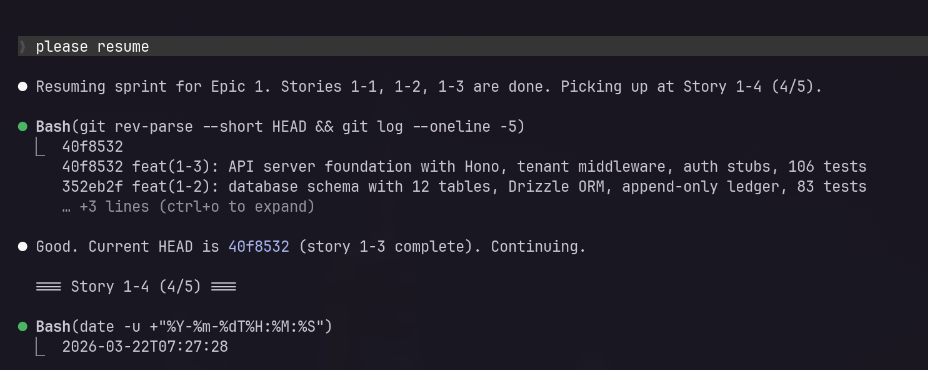

# Auto BMAD

[](LICENSE.md) [](https://docs.anthropic.com/en/docs/claude-code) [](https://github.com/bmad-code-org/BMAD-METHOD/releases/tag/v6.2.2) [](https://github.com/bmad-code-org/bmad-method-test-architecture-enterprise/releases/tag/v1.7.3) [](https://github.com/bmad-code-org/bmad-module-game-dev-studio/releases/tag/v0.2.2)

Automated BMAD pipeline orchestration for Claude Code. One command to run an entire sprint.

> Fork of [stefanoginella/auto-bmad](https://github.com/stefanoginella/auto-bmad), updated for BMAD-METHOD v6.2.2 with sprint automation and flattened agent architecture.

> **Permissions:** Running without `--dangerously-skip-permissions` will prompt you for approval on nearly every action, making unattended runs impossible. For sprint runs, use `claude --dangerously-skip-permissions`. **Use at your own risk -- only run in environments you trust.**

> **This is not a "make my app" button.** BMAD is built around human-AI collaboration -- brainstorming, research, and product discovery are meant to be interactive. Use auto-bmad for **execution** (sprint/story), not for **thinking** (analysis/planning). See [Workflow](#workflow) for details.

---

## Choose Your Mode

auto-bmad supports two execution modes. **Pick based on your project, subscription, and risk tolerance.**

| | Quick Mode | Full Mode |
|---|---|---|
| **What it does per story** | Create, develop, code review (3 steps) | Create, validate, adversarial review, ATDD, develop, edge-case hunt, 3x code review, trace, test automate (11 steps) |
| **What it does at epic-end** | Quinn QA (epic-level tests), retrospective (2 steps) | Trace, NFR assessment, test review, retrospective, context refresh (5 steps) |
| **Testing approach** | Tests generated at epic level by Quinn (built-in BMAD QA) | TDD per story -- ATDD writes failing tests, dev implements against them |
| **BMAD modules needed** | BMAD-METHOD only | BMAD-METHOD + TEA |
| **Duration per story** | ~25-35 min | ~60-90 min |
| **Tokens per story** | ~60-80k | ~150-200k |
| **Duration per sprint (5 stories)** | ~2.5-3.5h | ~5-6h |
| **Tokens per sprint (5 stories)** | ~350-450k | ~800k-1M |
| **Recommended plan** | Max x5 or higher | Max x5 minimum, x20 ideal |
| **Best for** | Prototypes, familiar domains, solo devs, simpler projects, tight token budgets | Production systems, complex domains, brownfield with breaking change risk, regulated environments |

### When to Use Quick Mode

- Building a prototype or proof of concept
- Working in a domain you know well
- Fewer than 5 epics, straightforward requirements
- Solo developer, want fast iteration
- On Max x5 and want to complete a sprint without hitting limits

### When to Use Full Mode

- Building production systems serving real users
- Complex or unfamiliar domain where spec weaknesses become implementation bugs
- Brownfield where a small change can break existing functionality
- You need per-story traceability (requirements -> tests -> code)
- You want TDD -- tests written before code, not after

---

## Real-World Results

| |
|---|
|  |
| `/auto-bmad-sprint 1` (full mode) -- 5 stories, ~6 hours, zero failures |

---

## Installation

```
/plugin marketplace add bramvera/claude-code-plugins
/plugin install auto-bmad@bramvera-plugins --scope user
/reload-plugins
```

Or as a local plugin:

```bash
git clone https://github.com/bramvera/auto-bmad.git
claude --plugin-dir /path/to/auto-bmad/auto-bmad
```

## Quick Start

```bash
# Plan the project
/auto-bmad-plan <product description or @file>

# Quick mode (no TEA needed, ~2.5-3.5h per epic)
/auto-bmad-sprint-quick 1

# Full mode (requires TEA, ~5-6h per epic)
/auto-bmad-sprint 1

# Check the report in the morning.
```

---

## Commands

Every command orchestrates existing BMAD skills -- nothing bypasses BMAD guardrails. See [Commands Reference](docs/commands-reference.md) for the exact BMAD skills each step calls.

### Quick Mode (BMAD Core -- no TEA required)

| Command | Description |
|---------|-------------|
| [`/auto-bmad-sprint-quick <epic>`](docs/commands-reference.md#auto-bmad-sprint-quick-epic) | Run an entire epic: 3 steps per story + Quinn QA + retro at epic-end |
| [`/auto-bmad-story-quick <id>`](docs/commands-reference.md#auto-bmad-story-quick-id) | Run a single story (3 steps): create, develop, code review |
| [`/auto-gds-sprint-quick <epic>`](docs/commands-reference.md#auto-gds-sprint-quick-epic) | GDS variant: run a game dev epic in quick mode |
| [`/auto-gds-story-quick <id>`](docs/commands-reference.md#auto-gds-story-quick-id) | GDS variant: run a single game dev story in quick mode |

### Full Mode (requires TEA module)

| Command | Description |
|---------|-------------|
| [`/auto-bmad-sprint <epic>`](docs/commands-reference.md#auto-bmad-sprint-epic) | Run an entire epic: 11 steps per story + 5-step epic-end ([details](#how-sprint-works)) |
| [`/auto-bmad-story <id>`](docs/commands-reference.md#auto-bmad-story-id) | Run a single story (11 steps): create, validate, ATDD, develop, 3x code review, trace, automate |
| [`/auto-bmad-epic-start <epic>`](docs/commands-reference.md#auto-bmad-epic-start-epic) | Epic-level test design (TEA) |
| [`/auto-bmad-epic-end <epic>`](docs/commands-reference.md#auto-bmad-epic-end-epic) | Trace, NFR, test review, retrospective, context refresh |
| [`/auto-gds-sprint <epic>`](docs/commands-reference.md#auto-gds-sprint-epic) | GDS variant: run a game dev epic in full mode |
| [`/auto-gds-story <id>`](docs/commands-reference.md#auto-gds-story-id) | GDS variant: run a single game dev story in full mode |
| [`/auto-gds-epic-start <epic>`](docs/commands-reference.md#auto-gds-epic-start-epic) | GDS epic-level game test design |
| [`/auto-gds-epic-end <epic>`](docs/commands-reference.md#auto-gds-epic-end-epic) | GDS retrospective, context refresh |

### Planning and Design

| Command | Description |
|---------|-------------|
| [`/auto-bmad-plan`](docs/commands-reference.md#auto-bmad-plan) | 11-step planning pipeline: product brief, PRD, UX, architecture, test design, epics, sprint plan |
| [`/auto-gds-plan`](docs/commands-reference.md#auto-gds-plan) | 8-step GDS planning: game brief, GDD, narrative, architecture, test design, sprint plan |

### Brownfield (Existing Codebase)

| Command | Description |
|---------|-------------|
| [`/auto-bmad-change-spec`](docs/commands-reference.md#auto-bmad-change-spec) | Interactive: assess scope, route to `bmad-correct-course` (significant) or `bmad-quick-spec` (minor) |
| [`/auto-bmad-change-dev <spec>`](docs/commands-reference.md#auto-bmad-change-dev-spec) | Automated: regression tests, ATDD, implement, full test suite, code review, trace |

---

## How Sprint Works

Both quick and full mode sprints share the same architecture: the coordinator runs each step as a direct Task call with fresh context (no nested agents), writes a progress file after every story, and continues to the next story on failure.

### Quick Mode Sprint

```
/auto-bmad-sprint-quick 1
```

**Lifecycle:** story 1-1 (3 steps) --> story 1-2 --> ... --> Quinn QA --> retro

No epic-start phase. Stories run 3 steps each (create, dev, review). At epic-end, Quinn (built-in BMAD QA) generates E2E tests for the entire epic, followed by a retrospective.

### Full Mode Sprint

```
/auto-bmad-sprint 1
```

**Lifecycle:** epic-start (test design) --> story 1-1 (11 steps) --> story 1-2 --> ... --> epic-end (trace, NFR, test review, retro, context refresh)

### Shared Sprint Features

**Failure handling:** If a story crashes (not test failures -- those are auto-fixed), the sprint retries once. If it still fails, it rolls back, logs the failure, and moves to the next story.

**What about dependent stories?** If story 1-1 fails, dependent stories 1-2 and 1-3 will likely fail too. Independent stories still complete. Fix the root cause, rerun the sprint -- it skips completed stories.

**Resumable:** Run the same command again -- or `please resume` in Claude Code. It reads `sprint-status.yaml`, skips completed stories, picks up where it left off.



*Terminal crashed mid-sprint. Resume picked up at story 1-4 (4/5) -- stories 1-1 through 1-3 were already committed and skipped.*

**Live progress:** After every story, a progress file is written to disk with status, duration, commit hashes, and failure details.

**Context management:** The coordinator discards Task results immediately and tracks only pass/fail + one-line summaries. Each step agent gets a fresh context window. No degradation on long runs.

### Duration and Token Comparison

| Command | Duration | Tokens |
|---------|----------|--------|
| `/auto-bmad-story-quick` | ~25-35m | ~60-80k |
| `/auto-bmad-sprint-quick` (5 stories) | ~2.5-3.5h | ~350-450k |
| `/auto-bmad-story` (full) | ~60-90m | ~150-200k |
| `/auto-bmad-sprint` (full, 5 stories) | ~5-6h | ~800k-1M |
| `/auto-bmad-plan` | ~40-60m | ~100-150k |

---

## Workflow

### Understanding the Phases

| Phase | Human or Auto? | Why |
|-------|---------------|-----|
| **Analysis** (brainstorming, research, product brief) | **Human-driven** | Collaborative discovery. The AI asks, you provide domain knowledge. Automating this loses the core value of BMAD. |
| **Planning** (PRD, UX, architecture, epics, sprint plan) | **Either** (see tradeoffs below) | Benefits from review and iteration, but can be automated with strong input. |
| **Execution** (story implementation, testing, reviews) | **Automated** | Stories are well-defined. Execution is mechanical. This is where auto-bmad saves you hours. |

### Analysis: Always Manual

Do not automate analysis. Run these BMAD skills interactively:

```
/bmad-brainstorming              <-- explore the idea
/bmad-party-mode                 <-- multi-agent discussion to find blind spots
/bmad-domain-research            <-- understand the space
/bmad-market-research            <-- competitive analysis
/bmad-create-product-brief       <-- guided discovery (the AI asks, you answer)
```

This produces the product brief that everything else builds on. Garbage in, garbage out.

### Planning: Tradeoffs

| | Manual Planning | `/auto-bmad-plan` |
|---|---|---|
| **Time** | 2-4 hours (human-paced) | ~40-60 min (automated) |
| **Quality** | Higher -- catch blind spots with `/bmad-party-mode` and `/bmad-advanced-elicitation` | Good -- but the AI may make assumptions you'd catch in review |
| **Best for** | Complex products, unfamiliar domains, high-stakes projects | Side projects, prototypes, familiar domains |

### Execution: Pick Your Mode

```bash
# Quick mode -- 3 steps per story, no TEA, ~2.5-3.5h per epic
/auto-bmad-sprint-quick 1

# Full mode -- 11 steps per story, TEA required, ~5-6h per epic
/auto-bmad-sprint 1
```

Review the sprint report after each epic. Fix any failed stories individually. Use `/bmad-correct-course` when plans need to change.

---

## Prerequisites

### BMAD Modules

| Component | Version | Required For |
|-----------|---------|-------------|
| [BMAD-METHOD](https://github.com/bmad-code-org/BMAD-METHOD/releases/tag/v6.2.2) | v6.2.2 | All pipelines |
| [TEA](https://github.com/bmad-code-org/bmad-method-test-architecture-enterprise/releases/tag/v1.7.3) | v1.7.3 | Full mode only (BMM) |
| [GDS](https://github.com/bmad-code-org/bmad-module-game-dev-studio/releases/tag/v0.2.2) | v0.2.2 | GDS pipelines |
| [CIS](https://github.com/bmad-code-org/bmad-module-creative-intelligence-suite) | latest | Optional: enhances UX design quality |

**Quick mode needs only BMAD-METHOD** (and GDS for game projects). No TEA required.

> **WDS removed from auto-bmad.** [WDS v0.3+](https://github.com/bmad-code-org/bmad-method-wds-expansion) introduced interactive visual design workflows (Figma round-trips, storyboarding, asset generation, HTML prototyping) that require human-in-the-loop participation. These cannot be run unattended by auto-bmad's automated pipeline. Use WDS directly via `/bmad-wds-*` skills inside Claude Code for the full interactive design experience.

### Config Files

Created by `npx bmad-method install`. The pipelines expect:

| Pipeline | Config Files |
|----------|-------------|
| Quick mode (BMM) | `_bmad/bmm/config.yaml` |
| Full mode (BMM) | `_bmad/bmm/config.yaml`, `_bmad/tea/config.yaml` |
| GDS (both modes) | `_bmad/gds/config.yaml` |

### Recommended Plugins

From [`anthropics/claude-plugins-official`](https://github.com/anthropics/claude-plugins-official):

- **context7** -- live docs lookups during architecture and development
- **security-guidance** -- security recommendations during development
- **lsp** plugins -- lint/test feedback for your stack

### CLI Tools

- `jq` (required) -- JSON processing in pipeline steps

---

## Documentation

- [BMM Tutorial](docs/tutorial-bmm.md) -- Step-by-step guide for the Business Model Method pipeline
- [GDS Tutorial](docs/tutorial-gds.md) -- Step-by-step guide for the Game Dev Suite pipeline
- [Commands Reference](docs/commands-reference.md) -- Every command mapped to the exact BMAD skills it calls
- [FAQ](docs/faq.md) -- Common questions, troubleshooting, and tips

---

## Credits

Built on the original [auto-bmad](https://github.com/stefanoginella/auto-bmad) by [Stefano Ginella](https://github.com/stefanoginella), who designed the core pipeline orchestration concept and the BMM/GDS command structure. This fork extends his work with quick/full modes, sprint automation, brownfield pipelines, flattened agent architecture, and context management optimizations.

The pipelines are powered by the [BMAD Method](https://github.com/bmad-code-org/BMAD-METHOD) by [bmad-code-org](https://github.com/bmad-code-org).

## License

[MIT](LICENSE.md)
