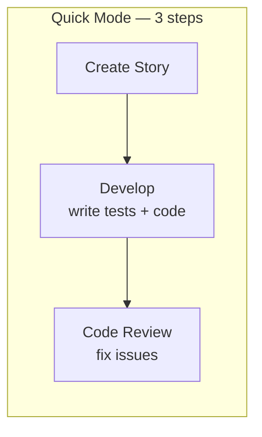
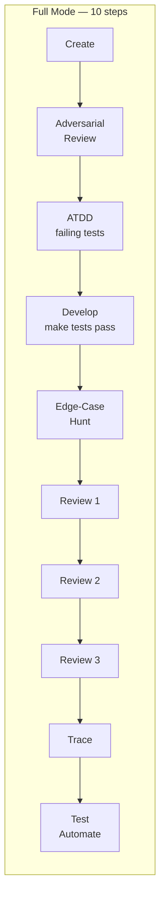

# Auto BMAD

[](LICENSE.md) [](https://docs.anthropic.com/en/docs/claude-code) [](https://github.com/bmad-code-org/BMAD-METHOD/releases/tag/v6.5.0) [](https://www.npmjs.com/package/bmad-method-test-architecture-enterprise) [](https://github.com/bmad-code-org/bmad-module-game-dev-studio/releases/tag/v0.2.2)

Structured SDLC pipeline for Claude Code, plus Codex diagnostics for BMAD 6.5 shared skill installs. Not a code generator -- an agile execution engine with testing, reviews, and traceability at every step.

> Fork of [stefanoginella/auto-bmad](https://github.com/stefanoginella/auto-bmad), updated for BMAD-METHOD v6.5.0 compatibility with sprint automation, diagnostics, and flattened agent architecture.

> **Permissions:** Running without `--dangerously-skip-permissions` will prompt you for approval on nearly every action, making unattended runs impossible. For sprint runs, use `claude --dangerously-skip-permissions`. **Use at your own risk -- only run in environments you trust.**

---

## This Is Not Vibe Coding

auto-bmad runs a real software development lifecycle. Every story goes through structured phases with quality gates -- not a single prompt that generates code and hopes for the best.

| | Vibe Coding | BMAD + auto-bmad |
|---|---|---|
| **Planning** | "build me an app" | PRD, architecture, UX specs, epics, acceptance criteria |
| **Testing** | Maybe, at the end | Code review per story (quick), TDD with ATDD + E2E (full) |
| **Code review** | None | Up to 3 adversarial reviews per story + edge-case hunting |
| **Traceability** | None | Requirements -> tests -> code mapping per story |
| **On failure** | Start over or manually fix | Retry, rollback to last checkpoint, resume from last good state |
| **Quality gates** | Hope | 3 checkpoints (quick) or 10 checkpoints (full) per story |

### What Runs Per Story





---

## Where auto-bmad Fits in BMAD

[BMAD](https://github.com/bmad-code-org/BMAD-METHOD) is an agile methodology with agents for each role (analyst, architect, PM, developer, etc.). auto-bmad automates the **execution phase** -- it does not replace the human-driven analysis and planning that makes BMAD work.

```
  INTERACTIVE (you + AI)                AUTOMATED (auto-bmad)
 ┌───────────────────────┐            ┌─────────────────────────┐
 │  Brainstorming        │            │  Story creation          │
 │  Domain research      │            │  Test-driven development │
 │  Product discovery    │   hand     │  Adversarial code review │
 │  PRD review           │ ───off──>  │  Edge-case hunting       │
 │  Architecture review  │            │  Traceability mapping    │
 │  Party-mode debates   │            │  Sprint reports          │
 └───────────────────────┘            └─────────────────────────┘
  You bring domain knowledge.          auto-bmad handles execution.
```

**Analysis and planning are meant to be interactive.** Automating them loses the core value of BMAD -- the AI asks questions, you provide domain knowledge, and the specs improve through iteration. See [Workflow](#workflow) for details.

---

## What You Gain and What You Trade

| What you gain | What you trade |
|---|---|
| Hours of unattended execution -- run overnight, review in the morning | No human review between stories (full mode compensates with 3x code review + adversarial review) |
| Consistent quality gates on every story, every time | Token cost (~60-80k per story quick, ~150-200k full) |
| Crash-proof resumable sprints with per-story git checkpoints | Less flexibility than running BMAD skills manually and iterating |
| Automatic rollback on failure -- no manual cleanup | Interactive BMAD skills (checkpoint-preview, party-mode) can't be used mid-sprint |

---

## BMAD Skills Compatibility

auto-bmad only orchestrates skills that run headlessly. Skills requiring human judgment mid-flow belong in your interactive planning phase.

| Skill | Works in auto-bmad? | Reason |
|---|---|---|
| `bmad-create-story` | Yes | Produces story file from epics without interaction |
| `bmad-dev-story` | Yes | Implements from spec, halts on blockers |
| `bmad-code-review` | Yes | Reviews and fixes issues autonomously |
| `bmad-qa-generate-e2e-tests` | Yes | Generates tests from implemented features |
| `bmad-testarch-atdd` | Yes | Writes failing tests from acceptance criteria |
| `bmad-checkpoint-preview` | **No** | Requires human walkthrough at each review stop |
| `bmad-create-story:validate` | **No** | Standalone validation is interactive/uncertified for unattended runs; story creation self-validates |
| `bmad-party-mode` | **No** | Multi-agent debate needs human moderation |
| WDS skills | **No** | Interactive Figma/design workflows |

New BMAD releases may add skills that are interactive by design. These will not be added to auto-bmad's automated pipelines -- use them directly in Claude Code during your planning phase.

---

## Choose Your Mode

auto-bmad supports two execution modes. **Pick based on your project, subscription, and risk tolerance.**

| | Quick Mode | Full Mode |
|---|---|---|
| **What it does per story** | Create, develop, code review (3 steps) | Create, adversarial review, ATDD, develop, edge-case hunt, 3x code review, trace, test automate (10 steps) |
| **What it does at epic-end** | Retrospective (1 step) | Trace, NFR assessment, test review, retrospective, context refresh (5 steps) |
| **Testing approach** | Code review per story (no separate test generation) | TDD per story -- ATDD writes failing tests, dev implements against them |
| **BMAD modules needed** | BMAD-METHOD only | BMAD-METHOD + TEA |
| **Duration per story** | ~25-35 min | ~60-90 min |
| **Tokens per story** | ~60-80k | ~150-200k |
| **Duration per sprint (5 stories)** | ~2.5-3.5h | ~5-6h |
| **Tokens per sprint (5 stories)** | ~350-450k | ~800k-1M |
| **Recommended plan** | Max x5 or higher | Max x5 minimum, x20 ideal |
| **Best for** | Prototypes, familiar domains, solo devs, simpler projects, tight token budgets | Production systems, complex domains, brownfield with breaking change risk, regulated environments |

### When to Use Quick Mode

- Building a prototype or proof of concept
- Working in a domain you know well
- Fewer than 5 epics, straightforward requirements
- Solo developer, want fast iteration
- On Max x5 and want to complete a sprint without hitting limits

### When to Use Full Mode

- Building production systems serving real users
- Complex or unfamiliar domain where spec weaknesses become implementation bugs
- Brownfield where a small change can break existing functionality
- You need per-story traceability (requirements -> tests -> code)
- You want TDD -- tests written before code, not after

---

## Real-World Results

| |
|---|
|  |
| `/auto-bmad-sprint 1` (full mode) -- 5 stories, ~6 hours, zero failures |

---

## Installation

### Claude Code

```
/plugin marketplace add bramvera/claude-code-plugins
/plugin install auto-bmad@bramvera-plugins --scope user
/reload-plugins
```

Or as a local plugin:

```bash
git clone https://github.com/bramvera/auto-bmad.git
claude --plugin-dir /path/to/auto-bmad/auto-bmad
```

### Codex

Codex plugins distribute skills, not Claude-style command files. In Codex, invoke the plugin through:

```text
$auto-bmad
$auto-bmad-check
$auto-bmad-codex
```

Users only need to remember `$auto-bmad`. With no specific workflow, it performs a fast YAML progress lookup and suggests the next story and epic. It does not print the full command menu unless the user asks for `menu`, `help`, or `list commands`.

No separate `auto-bmad` YAML config is required for BMAD v6.5+. The Codex status path uses `_bmad/bmm/config.yaml` and `sprint-status.yaml` when sprint planning has created it.

When a workflow is clear but an argument is missing, Codex does the same fast progress lookup as the Claude flow: it reads `_bmad/bmm/config.yaml`, resolves `_bmad-output/implementation-artifacts/sprint-status.yaml`, and suggests the next story or epic without running full diagnostics. For example, `$auto-bmad quick story` suggests the next pending story from `sprint-status.yaml`.

Plain `$auto-bmad` also prints numbered choices. Reply `1` to run the next story or `2` to run the next epic/sprint; `continue` uses option 1.

Before any execution, Codex runs a dirty-worktree preflight. If uncommitted changes exist, Auto-BMAD blocks and asks whether you want to handle them manually, create a safety commit, or abort. It must not skip a story or run rollback logic over dirty user work.

If Codex shows `Auto-BMAD [Plugin]`, the plugin is installed. The usable workflows are the bundled skills; in some Codex surfaces they appear namespaced as `auto-bmad:auto-bmad`, `auto-bmad:auto-bmad-check`, and `auto-bmad:auto-bmad-codex`.

Codex uses skills instead of native slash commands. Use `$auto-bmad` for status and workflow execution, `$auto-bmad-check` for diagnostics, and `$auto-bmad-codex` for dry-run command routing. See the [Codex Tutorial](docs/tutorial-codex.md) for the full Codex workflow.

### Shared Agent Skills CLIs

BMAD v6.5 can install shared skills into `.agents/skills` for CLIs such as Pi and other Agent Skills-compatible tools. Auto-BMAD can add matching workflow skills to that existing BMAD install:

```bash
npx @bramvera/auto-bmad init
```

From a local checkout:

```bash
node package/cli.js init
```

This copies generated Auto-BMAD workflow skills into the current repo's existing `.agents/skills` directory. It does not edit `.claude`, `.claude-plugin`, or the source `commands/*.md` files.

After init, slash-skill CLIs should expose entries such as:

```text
/skill:auto-bmad-sprint-quick
/skill:auto-bmad-story-quick
/skill:auto-bmad-sprint
/skill:auto-bmad-plan
```

Run `auto-bmad init --dry-run` to preview the copied skills. If `.agents/skills` does not exist, run the BMAD v6.5 installer for the project first.

## Recommended: RTK for Token Savings

[RTK (Rust Token Killer)](https://github.com/rtk-ai/rtk) is a CLI proxy that filters verbose tool output before it reaches Claude's context window, reducing token usage by 60-90% on common dev operations (git, build, test, lint). Since auto-bmad sprints run many shell commands over hours, RTK can significantly reduce your total token consumption.

```bash
# Install
cargo install rtk-cli

# Add to your Claude Code config
rtk init --global
```

Once installed, commands like `git status`, `cargo build`, and `pnpm install` are automatically rewritten to pass through RTK's filters — no changes to auto-bmad needed.

---

## Quick Start

```bash
# Plan the project
/auto-bmad-plan <product description or @file>

# Quick mode (no TEA needed, ~2.5-3.5h per epic)
/auto-bmad-sprint-quick 1

# Full mode (requires TEA, ~5-6h per epic)
/auto-bmad-sprint 1

# Check the report in the morning.
```

---

## Commands, Codex Skills, and Shared Skills

Every Auto-BMAD workflow orchestrates existing BMAD skills -- nothing bypasses BMAD guardrails. Claude Code exposes these workflows as slash commands. Codex exposes them through `$auto-bmad`. Shared Agent Skills CLIs expose the generated wrappers through their skill command surface.

| Host | Invocation style | Example |
|------|------------------|---------|
| Claude Code | Slash command | `/auto-bmad-sprint-quick 1` |
| Codex | Skill command | `$auto-bmad quick sprint 1` |
| Agent Skills CLI | Slash skill | `/skill:auto-bmad-sprint-quick 1` |

See [Commands Reference](docs/commands-reference.md) for the exact BMAD skills each workflow calls.

For Agent Skills CLIs, the generated skill list mirrors the Claude command list. Use `/skill:<command-name>` for the matching workflow, for example `/skill:auto-bmad-story 1-1`.

### Diagnostics

| Workflow | Claude Code | Codex | Description |
|----------|-------------|-------|-------------|
| Readiness check | [`/auto-bmad-check`](docs/commands-reference.md#auto-bmad-check) | `$auto-bmad-check` | Read-only capability check. Reports whether BMM quick is ready and lists optional full/GDS availability without requiring extra modules. |
| Status / next action | explicit command | `$auto-bmad` | Reads YAML progress and suggests the next story or epic. |
| Command menu | plugin command list | `$auto-bmad menu` | Lists available Auto-BMAD workflows. |

### Quick Mode (BMAD Core -- no TEA required)

| Workflow | Claude Code | Codex | Description |
|----------|-------------|-------|-------------|
| BMM quick sprint | [`/auto-bmad-sprint-quick <epic>`](docs/commands-reference.md#auto-bmad-sprint-quick-epic) | `$auto-bmad quick sprint <epic>` | Run an entire epic: 3 steps per story + retro at epic-end |
| BMM quick story | [`/auto-bmad-story-quick <id>`](docs/commands-reference.md#auto-bmad-story-quick-id) | `$auto-bmad quick story <id>` | Run a single story (3 steps): create, develop, code review |
| GDS quick sprint | [`/auto-gds-sprint-quick <epic>`](docs/commands-reference.md#auto-gds-sprint-quick-epic) | `$auto-bmad gds quick sprint <epic>` | GDS variant: run a game dev epic in quick mode |
| GDS quick story | [`/auto-gds-story-quick <id>`](docs/commands-reference.md#auto-gds-story-quick-id) | `$auto-bmad gds quick story <id>` | GDS variant: run a single game dev story in quick mode |

### Full Mode

| Workflow | Claude Code | Codex | Description |
|----------|-------------|-------|-------------|
| BMM full sprint | [`/auto-bmad-sprint <epic>`](docs/commands-reference.md#auto-bmad-sprint-epic) | `$auto-bmad full sprint <epic>` | Run an entire epic: 10 steps per story + 5-step epic-end ([details](#how-sprint-works)) |
| BMM full story | [`/auto-bmad-story <id>`](docs/commands-reference.md#auto-bmad-story-id) | `$auto-bmad full story <id>` | Run a single story (10 steps): create, adversarial review, ATDD, develop, 3x code review, trace, automate |
| BMM epic start | [`/auto-bmad-epic-start <epic>`](docs/commands-reference.md#auto-bmad-epic-start-epic) | `$auto-bmad epic start <epic>` | Epic-level test design (TEA) |
| BMM epic end | [`/auto-bmad-epic-end <epic>`](docs/commands-reference.md#auto-bmad-epic-end-epic) | `$auto-bmad epic end <epic>` | Trace, NFR, test review, retrospective, context refresh |
| GDS full sprint | [`/auto-gds-sprint <epic>`](docs/commands-reference.md#auto-gds-sprint-epic) | `$auto-bmad gds full sprint <epic>` | GDS variant: run a game dev epic in full mode |
| GDS full story | [`/auto-gds-story <id>`](docs/commands-reference.md#auto-gds-story-id) | `$auto-bmad gds full story <id>` | GDS variant: run a single game dev story in full mode |
| GDS epic start | [`/auto-gds-epic-start <epic>`](docs/commands-reference.md#auto-gds-epic-start-epic) | `$auto-bmad gds epic start <epic>` | GDS epic-level game test design |
| GDS epic end | [`/auto-gds-epic-end <epic>`](docs/commands-reference.md#auto-gds-epic-end-epic) | `$auto-bmad gds epic end <epic>` | GDS retrospective, context refresh |

BMM full mode requires TEA. GDS full mode requires GDS; it does not require TEA.

### Planning and Design

| Workflow | Claude Code | Codex | Description |
|----------|-------------|-------|-------------|
| BMM planning | [`/auto-bmad-plan`](docs/commands-reference.md#auto-bmad-plan) | `$auto-bmad plan` | 11-step planning pipeline: product brief, PRD, UX, architecture, test design, epics, sprint plan |
| GDS planning | [`/auto-gds-plan`](docs/commands-reference.md#auto-gds-plan) | `$auto-bmad gds plan` | 8-step GDS planning: game brief, GDD, narrative, architecture, test design, sprint plan |

### Brownfield (Existing Codebase)

| Workflow | Claude Code | Codex | Description |
|----------|-------------|-------|-------------|
| Change spec | [`/auto-bmad-change-spec`](docs/commands-reference.md#auto-bmad-change-spec) | `$auto-bmad change spec` | Interactive: assess scope, route to `bmad-correct-course` (significant) or direct minor-change spec generation |
| Change dev | [`/auto-bmad-change-dev <spec>`](docs/commands-reference.md#auto-bmad-change-dev-spec) | `$auto-bmad change dev <spec>` | Automated: regression tests, ATDD, implement, full test suite, code review, trace |

---

## How Sprint Works

Both quick and full mode sprints share the same architecture: the coordinator runs each step as a direct Task call with fresh context (no nested agents), writes a progress file after every story, and continues to the next story on failure.

### Quick Mode Sprint

```
/auto-bmad-sprint-quick 1
```

**Lifecycle:** story 1-1 (3 steps) --> story 1-2 --> ... --> retro

No epic-start phase. Stories run 3 steps each (create, dev, review). At epic-end, a retrospective captures lessons learned and action items.

### Full Mode Sprint

```
/auto-bmad-sprint 1
```

**Lifecycle:** epic-start (test design) --> story 1-1 (10 steps) --> story 1-2 --> ... --> epic-end (trace, NFR, test review, retro, context refresh)

### Shared Sprint Features

**Failure handling:** If a story crashes (not test failures -- those are auto-fixed), the sprint retries once. If it still fails, it rolls back, logs the failure, and moves to the next story.

**What about dependent stories?** If story 1-1 fails, dependent stories 1-2 and 1-3 will likely fail too. Independent stories still complete. Fix the root cause, rerun the sprint -- it skips completed stories.

**Resumable:** Run the same command again -- or `please resume` in Claude Code. It reads `sprint-status.yaml`, skips completed stories, picks up where it left off.


*Terminal crashed mid-sprint. Resume picked up at story 1-4 (4/5) -- stories 1-1 through 1-3 were already committed and skipped.*

**Live progress:** After every story, a progress file is written to disk with status, duration, commit hashes, and failure details.

**Context management:** The coordinator discards Task results immediately and tracks only pass/fail + one-line summaries. Each step agent gets a fresh context window. No degradation on long runs.

### Duration and Token Comparison

| Command | Duration | Tokens |
|---------|----------|--------|
| `/auto-bmad-story-quick` | ~25-35m | ~60-80k |
| `/auto-bmad-sprint-quick` (5 stories) | ~2.5-3.5h | ~350-450k |
| `/auto-bmad-story` (full) | ~60-90m | ~150-200k |
| `/auto-bmad-sprint` (full, 5 stories) | ~5-6h | ~800k-1M |
| `/auto-bmad-plan` | ~40-60m | ~100-150k |

---

## Workflow

### Understanding the Phases

| Phase | Human or Auto? | Why |
|-------|---------------|-----|
| **Analysis** (brainstorming, research, product brief) | **Human-driven** | Collaborative discovery. The AI asks, you provide domain knowledge. Automating this loses the core value of BMAD. |
| **Planning** (PRD, UX, architecture, epics, sprint plan) | **Either** (see tradeoffs below) | Benefits from review and iteration, but can be automated with strong input. |
| **Execution** (story implementation, testing, reviews) | **Automated** | Stories are well-defined. Execution is mechanical. This is where auto-bmad saves you hours. |

### Analysis: Always Manual

Do not automate analysis. Run these BMAD skills interactively:

```
/bmad-brainstorming              <-- explore the idea
/bmad-party-mode                 <-- multi-agent discussion to find blind spots
/bmad-domain-research            <-- understand the space
/bmad-market-research            <-- competitive analysis
/bmad-product-brief              <-- guided discovery (the AI asks, you answer)
```

This produces the product brief that everything else builds on. Garbage in, garbage out.

### Planning: Tradeoffs

| | Manual Planning | `/auto-bmad-plan` |
|---|---|---|
| **Time** | 2-4 hours (human-paced) | ~40-60 min (automated) |
| **Quality** | Higher -- catch blind spots with `/bmad-party-mode` and `/bmad-advanced-elicitation` | Good -- but the AI may make assumptions you'd catch in review |
| **Best for** | Complex products, unfamiliar domains, high-stakes projects | Side projects, prototypes, familiar domains |

### Execution: Pick Your Mode

```bash
# Quick mode -- 3 steps per story, no TEA, ~2.5-3.5h per epic
/auto-bmad-sprint-quick 1

# Full mode -- 10 steps per story, TEA required, ~5-6h per epic
/auto-bmad-sprint 1
```

Review the sprint report after each epic. Fix any failed stories individually. Use `/bmad-correct-course` when plans need to change.

---

## Prerequisites

### BMAD Modules

| Component | Version | Required For |
|-----------|---------|-------------|
| [BMAD-METHOD](https://github.com/bmad-code-org/BMAD-METHOD/releases/tag/v6.5.0) | v6.5.0 | All pipelines |
| [TEA](https://www.npmjs.com/package/bmad-method-test-architecture-enterprise) | v1.15.1 | Full mode only (BMM) |
| [GDS](https://github.com/bmad-code-org/bmad-module-game-dev-studio/releases/tag/v0.2.2) | v0.2.2 | GDS pipelines |
| [CIS](https://github.com/bmad-code-org/bmad-module-creative-intelligence-suite) | latest | Optional: enhances UX design quality |

**Quick mode needs only BMAD-METHOD** (and GDS for game projects). No TEA required.

Run `/auto-bmad-check` in Claude Code or `$auto-bmad-check` in Codex to verify the installed skill surface before starting a pipeline. It reports optional missing modules as warnings, not quick-mode failures.

BMAD v6.5 supports shared cross-agent skill installs through `.agents/skills`. Auto-BMAD exposes Claude Code slash commands, Codex `$` skills, and generated shared Agent Skills over the same BMAD skill layout. Run `auto-bmad init` after BMAD installation to copy the generated Auto-BMAD workflow skills into `.agents/skills`.

### Config Files

Created by `npx bmad-method install`. The pipelines expect:

| Pipeline | Config Files |
|----------|-------------|
| Quick mode (BMM) | `_bmad/bmm/config.yaml` |
| Full mode (BMM) | `_bmad/bmm/config.yaml`, `_bmad/tea/config.yaml` |
| GDS (both modes) | `_bmad/gds/config.yaml` |

### Recommended Plugins

From [`anthropics/claude-plugins-official`](https://github.com/anthropics/claude-plugins-official):

- **context7** -- live docs lookups during architecture and development
- **security-guidance** -- security recommendations during development
- **lsp** plugins -- lint/test feedback for your stack

### CLI Tools

- `jq` (required) -- JSON processing in pipeline steps

---

## Documentation

- [BMM Tutorial](docs/tutorial-bmm.md) -- Step-by-step guide for the Business Model Method pipeline
- [GDS Tutorial](docs/tutorial-gds.md) -- Step-by-step guide for the Game Dev Suite pipeline
- [Codex Tutorial](docs/tutorial-codex.md) -- Status, checks, command discovery, and dry-run routing in Codex
- [Commands Reference](docs/commands-reference.md) -- Every command mapped to the exact BMAD skills it calls
- [FAQ](docs/faq.md) -- Common questions, troubleshooting, and tips

---

## Credits

Built on the original [auto-bmad](https://github.com/stefanoginella/auto-bmad) by [Stefano Ginella](https://github.com/stefanoginella), who designed the core pipeline orchestration concept and the BMM/GDS command structure. This fork extends his work with quick/full modes, sprint automation, brownfield pipelines, flattened agent architecture, and context management optimizations.

The pipelines are powered by the [BMAD Method](https://github.com/bmad-code-org/BMAD-METHOD) by [bmad-code-org](https://github.com/bmad-code-org).

## License

[MIT](LICENSE.md)
